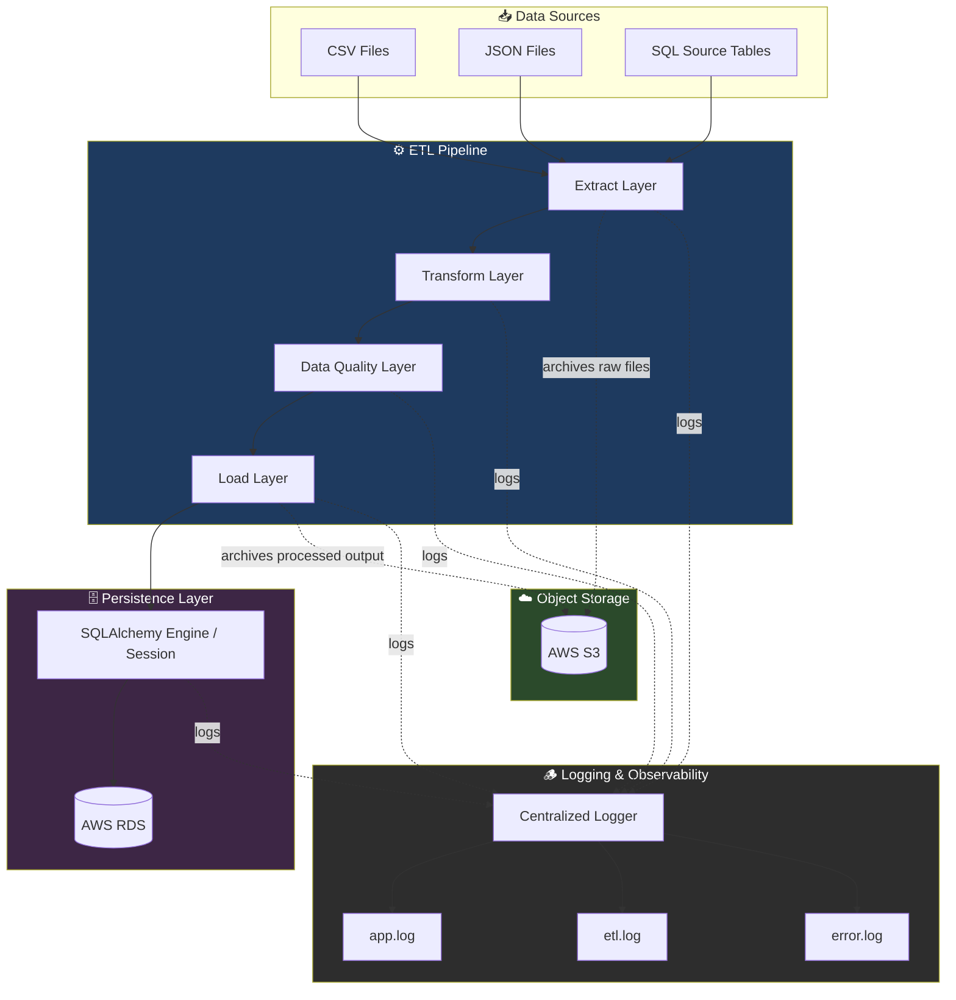
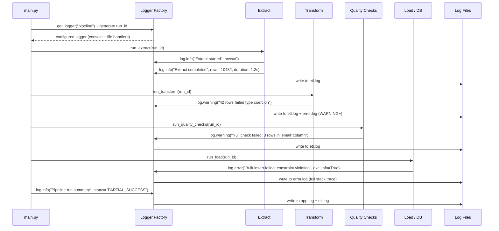
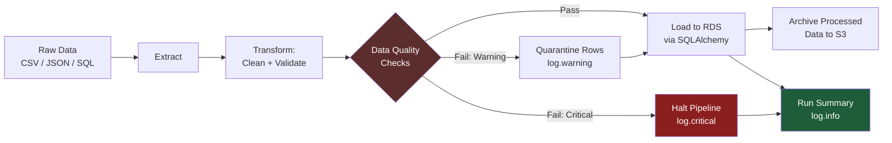

# ⚙️ logging-for-data-engineers

**logging-for-data-engineers** is not a "print statements with timestamps" logging tutorial. It is a reference implementation of how **logging functions as production infrastructure** inside a real data engineering stack.

Most engineers learn logging as an afterthought — a few `logging.info()` calls sprinkled into scripts. In production data platforms, logging is a **first-class architectural concern**: it is how you answer *"what happened, when, to which record, and why did it fail?"* at 3 AM when a pipeline breaks and a stakeholder is waiting on a dashboard refresh.

This project builds a complete, working ETL platform — extraction, transformation, loading, data quality validation, SQLAlchemy-backed persistence, and AWS S3/RDS integration — and uses that platform purely as the **vehicle** to demonstrate correct, production-grade logging design at every layer.

> **The pipeline is the stage. Logging is the subject.**

---

## 💼 Business Problem

In real data organizations, the majority of production incidents are not caused by bad logic — they're caused by **invisible failures**:

- A silent schema drift breaks downstream reports for three days before anyone notices.
- A partial file load corrupts a table, but no one can tell which rows loaded and which didn't.
- An ETL job "succeeds" (exit code 0) while actually processing zero rows.
- On-call engineers spend hours reproducing bugs that a single structured log line would have explained instantly.
- Auditors ask "who changed this record and when?" and the answer is "we don't know."

These are not application-logic problems. They are **observability problems** — and observability starts with disciplined, structured, contextual logging.

This project simulates those exact failure modes and shows how a properly engineered logging layer turns "we have no idea what happened" into "here is the exact row, timestamp, stage, and root cause."

---

## 🎯 Project Objectives

- Design a **centralized, reusable logging module** usable across every layer of a data platform.
- Demonstrate **structured logging** (JSON-formatted, machine-parseable) versus human-readable logging, and when to use each.
- Show how logging integrates with **SQLAlchemy** at the connection, session, and query level.
- Instrument a full **Extract → Transform → Load** pipeline with stage-aware, correlation-ID-based logging.
- Build a **data quality framework** (null checks, duplicate checks, schema checks) that logs violations as structured, queryable events rather than silent `print()` warnings.
- Implement logging-aware integrations with **AWS S3** (upload/download instrumentation) and **AWS RDS** (connection pooling, query performance, retry logic).
- Apply **log rotation, multi-handler routing, and severity-based filtering** the way production systems do (separate `app.log`, `etl.log`, `error.log` streams).
- Demonstrate **error handling strategy** — exception logging with stack traces, contextual metadata, and graceful degradation.
- Show how logs feed **monitoring and audit trail** requirements, not just debugging.
- Package all of the above as a **portfolio-ready artifact** that demonstrates senior-level data engineering judgment, not just syntax knowledge.

---

## ✨ Key Features

- 🧩 **Centralized logging module** (`src/logging/`) with a custom formatter, consistent handler configuration, and reusable logger factory.
- 🗂️ **Multi-destination log routing** — application logs, ETL-specific logs, and error-only logs are separated by concern, not just by level.
- 🔁 **Log rotation** using `RotatingFileHandler` / `TimedRotatingFileHandler` to simulate production retention policies.
- 🆔 **Correlation IDs** injected into every log record so a single pipeline run can be traced end-to-end across extract, transform, and load stages.
- 🧱 **Layered ETL pipeline** (`extract/`, `transform/`, `load/`) with logging instrumented at every stage boundary.
- ✅ **Data quality framework** (`quality/`) that logs structured violation records (which rule, which table, which row count, which severity).
- 🗄️ **SQLAlchemy engine/session/model layer** with query-level logging and connection lifecycle logging.
- ☁️ **AWS S3 and RDS integration** with logging around retries, latency, and failure modes — the details that matter in production cloud data pipelines.
- ⚙️ **YAML-driven configuration** (`config/config.yaml`, `config/database.yaml`) so logging behavior, database credentials, and pipeline parameters are environment-aware, not hardcoded.
- 🧪 **Test suite** validating both pipeline correctness *and* that logging fires as expected under failure conditions.
- 📊 **Mermaid diagrams** throughout this README documenting architecture, ETL flow, and logging flow — because a senior engineer documents systems visually, not just verbally.

---

## 🪶 Logging Capabilities

| Capability | Description |
|---|---|
| **Structured Logging** | JSON-formatted log records for machine parsing (log aggregators, SIEM, ELK/CloudWatch-style ingestion). |
| **Human-Readable Logging** | Console-friendly formatted output for local development and debugging. |
| **Multi-Handler Routing** | Simultaneous routing to console, `app.log`, `etl.log`, and `error.log` based on logger name and severity. |
| **Custom Formatters** | `custom_formatter.py` injects contextual fields (pipeline stage, correlation ID, row count, duration) into every record. |
| **Log Levels as Contracts** | `DEBUG` for developer detail, `INFO` for pipeline milestones, `WARNING` for data quality issues, `ERROR` for recoverable failures, `CRITICAL` for pipeline-halting failures. |
| **Log Rotation & Retention** | Size-based and time-based rotation to prevent unbounded log growth, mirroring production retention policies. |
| **Correlation / Run IDs** | Every ETL run is tagged with a unique ID so logs across extract/transform/load can be joined and traced. |
| **Exception Logging** | Full stack traces captured with `exc_info=True`, paired with contextual metadata (which file, which record, which stage). |
| **Performance Logging** | Stage duration, row throughput, and query timing logged for performance auditing. |
| **Audit-Style Logging** | Data load events logged with who/what/when metadata to support audit trail requirements. |

---

## 🏗️ Architecture Overview



**Design rationale:** Logging is drawn as its own cross-cutting layer rather than a footnote inside the pipeline box. Every functional layer — extract, transform, quality, load, and the database engine itself — reports into a single centralized logger, which then fans out to purpose-specific log files. This mirrors how production platforms separate *general application health* (`app.log`) from *pipeline-specific execution detail* (`etl.log`) from *actionable failures* (`error.log`), so an on-call engineer can `tail -f error.log` without wading through informational noise.

---

## 📁 Project Structure

```text
pylog-dataops/
│
├── config/                     # Environment-aware configuration (YAML)
│   ├── config.yaml             # App + logging configuration
│   └── database.yaml           # Database connection configuration
│
├── logs/                       # Runtime log output (rotated, gitignored)
│   ├── app.log                 # General application-level events
│   ├── etl.log                 # Pipeline execution detail
│   └── error.log               # Errors and exceptions only
│
├── src/
│   ├── database/                # SQLAlchemy engine, session, ORM models
│   │   ├── connection.py
│   │   ├── engine.py
│   │   ├── session.py
│   │   └── models.py
│   │
│   ├── logging/                 # Centralized logging module
│   │   ├── logger.py
│   │   └── custom_formatter.py
│   │
│   ├── extract/                 # Extraction layer (CSV/JSON/SQL sources)
│   │   ├── csv_reader.py
│   │   ├── json_reader.py
│   │   └── sql_reader.py
│   │
│   ├── transform/                # Cleaning, validation, business rules
│   │   ├── cleaning.py
│   │   ├── validation.py
│   │   └── business_rules.py
│   │
│   ├── load/                     # Load layer (single-row + bulk loading)
│   │   ├── sql_loader.py
│   │   └── bulk_loader.py
│   │
│   ├── quality/                  # Data quality framework
│   │   ├── null_checks.py
│   │   ├── duplicate_checks.py
│   │   └── schema_checks.py
│   │
│   ├── utils/                    # Shared helpers
│   │   ├── helpers.py
│   │   ├── file_utils.py
│   │   └── date_utils.py
│   │
│   └── main.py                   # Pipeline orchestration entry point
│
├── data/
│   ├── raw/                      # Incoming, unprocessed data
│   ├── processed/                # Cleaned, validated output
│   └── archive/                  # Historical / S3-mirrored data
│
├── tests/
│   ├── test_connection.py
│   ├── test_etl.py
│   └── test_validation.py
│
├── requirements.txt
├── .env
├── README.md
└── .gitignore
```

---

## 🧩 Module-by-Module Explanation

### `src/logging/`
The heart of the project. `logger.py` exposes a `get_logger(name)` factory so every module gets a consistently configured logger instead of ad-hoc `logging.basicConfig()` calls scattered across the codebase. `custom_formatter.py` defines a formatter that injects structured context (timestamp, module, correlation ID, log level, message) and supports both human-readable and JSON output modes.

**Why it exists:** Centralizing logger configuration is what prevents the classic anti-pattern of "every module configures logging differently," which leads to duplicate log lines, inconsistent formats, and handlers that silently stop working when one module calls `basicConfig()` after another already has.

### `src/database/`
`engine.py` builds the SQLAlchemy engine from `database.yaml`, with connection pooling and `echo` behavior tied to log level. `session.py` provides scoped sessions with lifecycle logging (open/commit/rollback/close). `models.py` defines ORM models. `connection.py` wraps connection attempts with retry logic and logs each attempt, backoff interval, and eventual success/failure.

**Why it exists:** Database connectivity is one of the most common silent-failure points in data platforms. Logging connection lifecycle events turns "the pipeline just hung" into "connection attempt 3 of 5 failed: timeout after 30s, retrying in 8s."

### `src/extract/`
Readers for CSV, JSON, and SQL sources. Each reader logs file/query identity, row counts read, and elapsed time — establishing a baseline for downstream data quality comparisons (e.g., "extract read 10,482 rows" vs. "load wrote 10,479 rows" is itself a loggable, alertable discrepancy).

### `src/transform/`
`cleaning.py` handles type coercion and formatting; `validation.py` enforces structural rules; `business_rules.py` applies domain-specific logic. Every rejected or modified record is logged with enough context to answer "why was this row changed or dropped?" without needing to re-run the pipeline.

### `src/load/`
`sql_loader.py` handles row-by-row loads (with per-row error isolation and logging); `bulk_loader.py` handles high-throughput bulk inserts (with batch-level logging, since per-row logging at bulk scale would itself become a performance and log-volume problem — a real production trade-off this project deliberately demonstrates).

### `src/quality/`
Implements null checks, duplicate checks, and schema checks as independent, composable validators. Each check logs a structured result object (rule name, table, affected row count, severity) rather than a free-text warning — making quality issues queryable from the logs themselves.

### `src/utils/`
Shared helpers for file I/O, date parsing, and misc utilities — kept deliberately "boring" so that logging patterns demonstrated elsewhere aren't diluted by unrelated logic.

### `src/main.py`
Orchestrates the full pipeline: generates a run/correlation ID, initializes logging, executes extract → transform → quality → load in sequence, and logs a final run summary (rows in, rows out, rows rejected, duration, status).

---

## 🔄 Logging Workflow



**Why this matters:** Notice that the *same* logger instance routes to different files based on severity — `INFO` events land in `etl.log`, but `ERROR` events are duplicated into `error.log`. This is a standard production pattern (multi-handler routing with level filters) that lets an on-call engineer monitor `error.log` exclusively without missing anything critical.

---

## 🔁 ETL Workflow



Each arrow in this diagram corresponds to a real, loggable event boundary in `main.py`. The pipeline distinguishes between **critical quality failures** (schema mismatch — halt immediately) and **warning-level quality failures** (a handful of null emails — quarantine and continue), which is itself a logging-driven design decision: not all failures deserve the same severity or the same operational response.

---

## ✅ Data Quality Framework

The `quality/` package implements three independent validators, each returning a structured result rather than a boolean:

```python
{
  "check_name": "null_check",
  "table": "customers",
  "column": "email",
  "rows_affected": 3,
  "severity": "WARNING",
  "run_id": "a1b2c3d4"
}
```

- **`null_checks.py`** — flags unexpected nulls in non-nullable business fields.
- **`duplicate_checks.py`** — detects duplicate primary/business keys before load.
- **`schema_checks.py`** — validates incoming data structure against the expected schema (column names, types, required fields) before it ever reaches the load layer.

**Why structured results instead of print warnings:** A structured quality-check result can be logged as JSON, shipped to a log aggregator, and turned into an alert or dashboard metric. A free-text `print("some nulls found")` cannot. This is the difference between logging for a human reading a terminal and logging for a *system* that reads logs.

---

## 🗄️ SQLAlchemy Integration

- **Engine-level logging:** connection pool checkouts/checkins are logged at `DEBUG`, surfacing pool exhaustion issues before they cause timeouts.
- **Session lifecycle logging:** every session logs its open, commit, rollback, and close events — critical for diagnosing transaction leaks.
- **Query performance logging:** slow queries (above a configurable threshold) are logged at `WARNING` with the query duration and (sanitized) statement.
- **Retry-aware connection logging:** `connection.py` wraps initial connection attempts in exponential backoff, logging each retry attempt distinctly from the final failure.

```python
# src/database/engine.py (excerpt)
from sqlalchemy import create_engine, event
from src.logging.logger import get_logger

log = get_logger(__name__)

engine = create_engine(DB_URL, pool_pre_ping=True, pool_size=5)

@event.listens_for(engine, "checkout")
def log_checkout(dbapi_conn, connection_record, connection_proxy):
    log.debug("Connection checked out from pool", extra={"pool_size": engine.pool.size()})
```

---

## ☁️ AWS S3 Integration

Raw and processed files are archived to S3 as part of the pipeline's durability strategy. Every S3 operation is logged with:

- Object key, bucket name, and file size
- Upload/download duration
- Retry attempts on transient network failures
- Explicit `log.error()` with `exc_info=True` on `ClientError` / `NoCredentialsError`

```python
# src/utils/file_utils.py (excerpt)
def upload_to_s3(local_path, bucket, key):
    log.info("Starting S3 upload", extra={"bucket": bucket, "key": key})
    try:
        s3_client.upload_file(local_path, bucket, key)
        log.info("S3 upload succeeded", extra={"bucket": bucket, "key": key})
    except ClientError:
        log.error("S3 upload failed", extra={"bucket": bucket, "key": key}, exc_info=True)
        raise
```

**Why this matters:** Cloud storage failures are often transient and easy to miss. Logging every attempt — not just failures — creates an audit trail that shows whether an issue is a one-off blip or a systemic pattern.

---

## 🛢️ AWS RDS Integration

The `database.yaml` configuration supports pointing the SQLAlchemy engine at an AWS RDS instance (PostgreSQL/MySQL). Logging here focuses on:

- Connection establishment and SSL handshake outcomes
- Pool saturation warnings under load
- Query timeout and deadlock detection, logged at `ERROR` with the offending statement (sanitized of sensitive parameters)
- Bulk load throughput (`bulk_loader.py`) logged as rows/second, useful for capacity planning

This mirrors how production teams instrument managed database connections — not just "did it connect," but "how healthy is the connection under sustained load."

---

## ⚙️ Configuration Management

All environment-specific values live in YAML, never hardcoded in source:

- **`config/config.yaml`** — logging levels, log file paths, rotation policy, pipeline batch sizes
- **`config/database.yaml`** — database dialect, host, port, pool settings (credentials pulled from `.env`, never committed)
- **`.env`** — secrets (DB password, AWS keys) loaded via `python-dotenv`, excluded from version control via `.gitignore`

**Why this matters:** Hardcoded configuration is one of the fastest ways to leak credentials into a public GitHub repo and to make a pipeline impossible to promote from dev → staging → prod without code changes.

---

## 🚨 Error Handling Strategy

| Failure Type | Handling Approach | Log Level |
|---|---|---|
| Transient network/DB error | Retry with exponential backoff | `WARNING` per retry, `ERROR` on exhaustion |
| Data quality violation (non-critical) | Quarantine row, continue pipeline | `WARNING` |
| Schema mismatch | Halt pipeline immediately | `CRITICAL` |
| Unexpected exception | Catch, log full stack trace, re-raise or fail gracefully | `ERROR` with `exc_info=True` |
| Resource exhaustion (pool/memory) | Log with system metrics context, alertable | `ERROR` / `CRITICAL` |

Every exception handler in this codebase follows one rule: **never swallow an exception silently.** At minimum, every `except` block logs enough context to reconstruct what happened without a debugger attached.

---

## 📡 Monitoring & Observability

- **Structured JSON logs** are designed to be ingestion-ready for tools like CloudWatch Logs, the ELK stack, or Datadog — no reformatting required.
- **Run summaries** logged at the end of every pipeline execution (`rows_extracted`, `rows_loaded`, `rows_rejected`, `duration_seconds`, `status`) act as lightweight metrics even without a dedicated metrics system.
- **Correlation IDs** allow every log line from a single pipeline run to be filtered and reconstructed as one coherent timeline — the foundation of distributed tracing, implemented here at a single-pipeline scale.
- **Severity-based file routing** (`error.log` isolation) enables simple alerting (e.g., a cron job or CloudWatch alarm that pages on-call when `error.log` receives new lines).

---

## 🛠️ Installation Guide

**Prerequisites:**
- Python 3.10+
- pip / virtualenv
- AWS account with S3 and RDS access (optional — pipeline runs against local SQLite/Postgres for local development)

```bash
# Clone the repository
git clone https://github.com/<your-username>/pylog-dataops.git
cd pylog-dataops

# Create and activate a virtual environment
python -m venv venv
source venv/bin/activate      # On Windows: venv\Scripts\activate

# Install dependencies
pip install -r requirements.txt
```

---

## 🔧 Setup Instructions

1. Copy the example environment file and populate secrets:
   ```bash
   cp .env.example .env
   ```
2. Edit `.env` with your database and AWS credentials:
   ```env
   DB_USER=your_db_user
   DB_PASSWORD=your_db_password
   DB_HOST=localhost
   DB_PORT=5432
   DB_NAME=dataops_db

   AWS_ACCESS_KEY_ID=your_key
   AWS_SECRET_ACCESS_KEY=your_secret
   AWS_S3_BUCKET=your-bucket-name
   ```
3. Review and adjust `config/config.yaml` and `config/database.yaml` for your environment.
4. Ensure the `logs/` directory exists (created automatically on first run if missing).
5. Run the pipeline:
   ```bash
   python -m src.main
   ```

---

## 📋 Configuration Examples

**`config/config.yaml`**
```yaml
logging:
  level: INFO
  format: json          # options: json | text
  rotation:
    type: size           # options: size | time
    max_bytes: 5242880   # 5 MB
    backup_count: 5
  files:
    app: logs/app.log
    etl: logs/etl.log
    error: logs/error.log

pipeline:
  batch_size: 1000
  max_retries: 3
  retry_backoff_seconds: 5
```

**`config/database.yaml`**
```yaml
database:
  dialect: postgresql
  driver: psycopg2
  pool_size: 5
  max_overflow: 10
  pool_timeout: 30
  echo: false
```

---

## 🚀 Usage Examples

```bash
# Run the full ETL pipeline
python -m src.main

# Run with a specific log level override
python -m src.main --log-level DEBUG

# Run only the data quality checks against existing data
python -m src.quality.schema_checks --table customers
```

```python
# Programmatic usage
from src.main import run_pipeline

result = run_pipeline(source="data/raw/customers.csv", target_table="customers")
print(result.summary)
# {'rows_extracted': 10482, 'rows_loaded': 10439, 'rows_rejected': 43, 'status': 'PARTIAL_SUCCESS'}
```

---

## 🪵 Logging Examples

```python
from src.logging.logger import get_logger

log = get_logger(__name__)

# Basic informational logging
log.info("ETL run started", extra={"run_id": run_id, "source": "customers.csv"})

# Structured warning with context
log.warning(
    "Data quality violation detected",
    extra={"check": "null_check", "column": "email", "rows_affected": 3}
)

# Exception logging with full stack trace
try:
    load_batch(records)
except IntegrityError:
    log.error("Bulk load failed due to constraint violation", exc_info=True)
    raise

# Performance logging
log.info("Stage completed", extra={"stage": "transform", "duration_seconds": 2.41, "rows": 10482})
```

---

## 📄 Sample Log Outputs

**`etl.log` (human-readable mode):**
```text
2026-02-14 09:12:03,221 | INFO  | extract.csv_reader | run_id=a1b2c3d4 | Extract started: data/raw/customers.csv
2026-02-14 09:12:04,438 | INFO  | extract.csv_reader | run_id=a1b2c3d4 | Extract completed: 10482 rows in 1.22s
2026-02-14 09:12:04,551 | WARNING | transform.validation | run_id=a1b2c3d4 | 42 rows failed type coercion on column 'signup_date'
2026-02-14 09:12:05,102 | WARNING | quality.null_checks | run_id=a1b2c3d4 | Null check failed: 3 rows in 'email' column
2026-02-14 09:12:06,884 | INFO  | load.bulk_loader | run_id=a1b2c3d4 | Bulk load completed: 10439 rows in 1.78s (5864 rows/sec)
2026-02-14 09:12:06,901 | INFO  | main | run_id=a1b2c3d4 | Pipeline run summary: status=PARTIAL_SUCCESS, rejected=43
```

**`error.log` (structured JSON mode):**
```json
{
  "timestamp": "2026-02-14T09:15:41.223Z",
  "level": "ERROR",
  "logger": "load.sql_loader",
  "run_id": "f9e8d7c6",
  "message": "Bulk insert failed due to constraint violation",
  "table": "orders",
  "exception": "IntegrityError",
  "traceback": "Traceback (most recent call last): ..."
}
```

---

## 🧪 Testing Framework

Tests are built with `pytest` and cover both **functional correctness** and **logging behavior**:

- `test_connection.py` — validates engine creation, pool configuration, and retry/backoff logging on simulated connection failure.
- `test_etl.py` — validates end-to-end pipeline execution and confirms expected log records are emitted at each stage (using `caplog`).
- `test_validation.py` — validates data quality checks produce correctly structured violation records.

```bash
# Run the full test suite
pytest tests/ -v

# Run with coverage
pytest tests/ --cov=src --cov-report=term-missing
```

```python
# Example: asserting logging behavior, not just return values
def test_extract_logs_row_count(caplog):
    with caplog.at_level(logging.INFO):
        extract_csv("data/raw/customers.csv")
    assert "Extract completed" in caplog.text
    assert "10482" in caplog.text
```

---

## 🔮 Future Enhancements

- [ ] Integrate with **OpenTelemetry** for distributed tracing across pipeline stages.
- [ ] Ship structured logs to **CloudWatch Logs** or an **ELK stack** for real dashboarding.
- [ ] Add **Prometheus metrics export** alongside log-based run summaries.
- [ ] Implement **PySpark/Polars logging adapters** to demonstrate logging patterns at distributed-compute scale.
- [ ] Add **Slack/PagerDuty alerting** triggered directly from `CRITICAL` log events.
- [ ] Containerize with **Docker** and add a **CI/CD pipeline** (GitHub Actions) running tests and log-format linting on every PR.
- [ ] Add **log sampling** strategies for high-volume production-scale workloads.

---

## 🎓 Skills Demonstrated

- Production-grade Python logging design (handlers, formatters, filters, rotation)
- Structured/JSON logging for machine-readable observability
- SQLAlchemy engine, session, and ORM instrumentation
- AWS S3 and RDS integration with cloud-aware error handling
- ETL pipeline design and orchestration
- Data quality framework design and structured validation reporting
- Configuration management via YAML and environment variables
- Exception handling strategy and stack-trace-preserving error logging
- Test-driven development, including testing logging behavior itself
- Technical documentation and system diagramming (Mermaid)

---

## 📚 Learning Outcomes

By building and studying this project, you will understand:

- Why logging should be treated as **infrastructure**, not an afterthought
- How to design a **logger factory pattern** for consistent configuration across a codebase
- How to route logs by **severity and concern** using multiple handlers
- How to inject **contextual metadata** (correlation IDs, row counts, durations) into log records
- How logging integrates with **ORMs, cloud services, and ETL pipelines** in practice
- How to distinguish **critical vs. recoverable** failures and handle each appropriately
- How structured logs become the foundation for **monitoring, alerting, and audit trails**

---

## 🧰 Technology Stack

| Category | Technology |
|---|---|
| Language | Python 3.10+ |
| Logging | `logging` (stdlib), custom formatters/handlers |
| ORM / DB Access | SQLAlchemy 2.x |
| Cloud Storage | AWS S3 (`boto3`) |
| Cloud Database | AWS RDS (PostgreSQL) |
| Data Processing | Pandas, PySpark, Polars (illustrative use) |
| Configuration | YAML, `python-dotenv` |
| Testing | `pytest`, `pytest-cov` |
| Diagramming | Mermaid (embedded in Markdown) |

---

## 💡 Portfolio Value

This project is designed to answer the question every hiring manager and technical interviewer implicitly asks: *"Can this person build systems that survive production, not just demos?"*

It demonstrates:

- **Systems thinking** — logging is treated as a cross-cutting architectural layer, not a utility import.
- **Production judgment** — severity routing, retry strategy, and critical-vs-warning distinctions mirror real on-call decision-making.
- **Cloud fluency** — genuine AWS S3/RDS integration, not mocked or hand-waved.
- **Communication skill** — this README itself, with its diagrams and rationale sections, demonstrates the ability to document systems for both engineers and non-technical stakeholders.

---

## 🤝 Contributing

Contributions, suggestions, and issue reports are welcome.

1. Fork the repository
2. Create a feature branch: `git checkout -b feature/your-feature-name`
3. Commit your changes with clear, descriptive messages
4. Push to your branch and open a Pull Request
5. Ensure `pytest tests/` passes before submitting

Please open an issue first for major changes to discuss scope and approach.

---

## 📜 License

This project is licensed under the **MIT License** — see the [LICENSE](LICENSE) file for details.

---

<div align="center">

**Built to demonstrate production-grade logging practices in modern data engineering.**

⭐ If this project helped you understand logging in a real-world data context, consider starring the repo.

</div>
